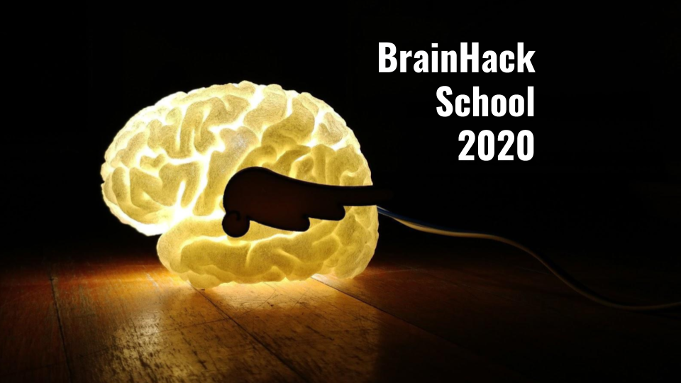

# Daniel's Brainhack School Project

Team contributors: noor and michelle and tajwar and ziad and erjun

## Summary 

To integrate the lessons learned in week 1 of Brainhack School whice still contributing work to my PhD, I have decided to change my workflow to use more reproducible tools such as Jupyter Notebook and Docker. The best integration of these tools in a Neuroscience context, for me, seems to be NiPype. I would like to move my current dMRI analysis to a NiPype workflow to facilitate replication and sharing. Because I am working with "tough to crack" data, i.e. neonatal MRI scans in asphyxiated newborns, I want to structure a pipeline I can easily modify to try out different techniques on my data (most available algorithms are not designed for these data). The framework provided by NiPype allows for standardised pipelines to be created which can be then tweaked easily and reproduced within Docker containers. Transfering my current workflow to this framework would expose me to most tools seen during week 1, with the exception of machine learning. 

## Project definition 

### Background

Neonatal background tools that don't work and those that do

### Tools 

NiPype:

### Data 

### Deliverables

## Results 

### Progress overview

### Tools I learned during this project

 
### Results 

#### Deliverable 1: report template

 

#### Deliverable 2: project gallery

 
##### Other projects

 
 
## Conclusion and acknowledgement

